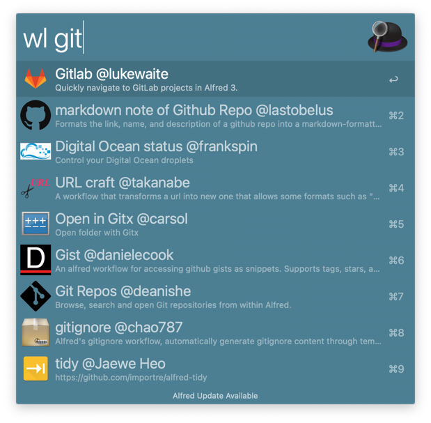
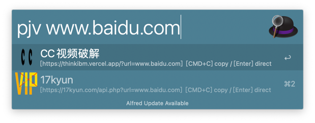
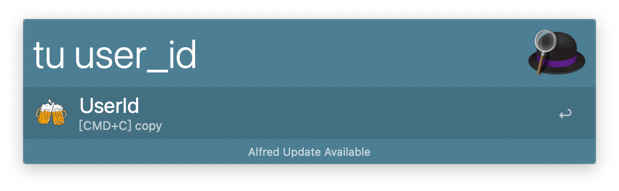

#  helper
   

[点击下载](https://github.com/demoManito/helper/releases/download/v1.1.0/helper.alfredworkflow)

## workflow search

操作列表：
- [Enter] : 打开 workflow 主页
- [Cmd + C] : 拷贝 workflow 下载地址
- [Cmd + Enter] : 一键安装，开始后台下载，下载完成后会弹出 Alfred 导入 workflow 弹窗，点击导入即可完成安装。

## 视频破解

列表操作：
- 输入 [Enter] : 打开破解网站，选择播放线路。
- 输入 [Cmd + C] : 拷贝破解网站地址。

## 大小写转换
- tu 转大写

- tl 转小写

操作列表：
- 输入 [Enter] : 拷贝到剪切板，当光标选中会直接拷贝到光标处。
- 输入 [Cmd + C] : 拷贝转换后的值。
